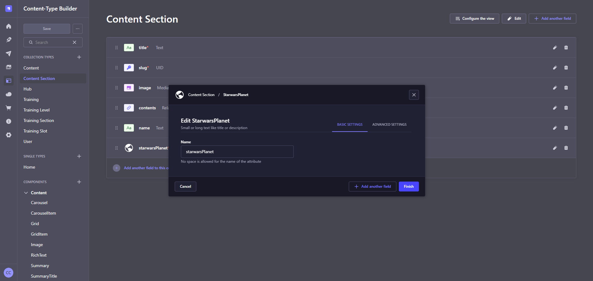

<div align="center" width="150px">
  
</div>
<div align="center">
  <h1>Strapi v5 - Plugin Generic Custom Fields</h1>
  <p>Powerful Strapi Plugin to easily create Custom Fields</p>
  <a href="https://www.npmjs.org/package/strapi-plugin-generic-custom-fields">
    
  </a>
  <a href="https://www.npmjs.org/package/strapi-plugin-generic-custom-fields">
    
  </a>
</div>

---

<div style="margin: 20px 0" align="center">
  
</div>

A plugin for [Strapi Headless CMS](https://github.com/strapi/strapi) that provides a powerful and easy way to add custom fields to your Strapi entities.

## Features
- Add custom fields to entities with a simple configuration.

### What can it be used for?
- Create an Enum field with labels
- Fetch items from an API (with or without authentication)
- Fetch items from a local source (json file, database, etc.)

## Roadmap
- Support pagination for fetching items
- Support for different field types (text, number, date, etc.)
- Validation rules for custom fields

## Usage

To configure the Generic Custom Fields plugin, add your custom fields configuration to the plugin settings. Each custom field should follow this structure:

```typescript
type Config = {
  customFields: [
    {
      name: string;         // The unique name of the custom field.
      description?: string; // A description for the custom field.
      icon?: string;        // One of the supported StrapiIcon names, e.g. 'Alien', 'Archive', 'ArrowDown', etc.
      inputSize?: {
        default: 4 | 6 | 8 | 12; // Default input size.
        isResizable: boolean;    // Whether the input size can be changed.
      };
      fetchItems: (query: string): Item[] | Promise<Item[]>; // Function to fetch multiple items.
      fetchItem: (value: string): Item | Promise<Item>;      // Function to fetch a single item.
    },
  ]
}
type Item = {
    value: string; // Unique identifier for the item. This is used to store the value of the custom field.
    label: string; // Label of the item.
};
```
This configuration allows you to define custom fields that can fetch items either synchronously or asynchronously. The `fetchItems` function is used to retrieve a list of items based on a query string that can be empty, while the `fetchItem` function retrieves a single item based on its value.

### Example Configuration

```typescript
// config/plugins.ts
import type { Config as GenericCustomFieldsConfig } from 'strapi-plugin-generic-custom-fields'

export default () => ({
  'generic-custom-fields': {
    enabled: true,
    config: {
      customFields: [
        { // Non Async Example (Enum with labels)
          name: 'Category',
          description: 'Select a category',
          icon: 'PuzzlePiece',
          inputSize: { default: 6, isResizable: true },
          fetchItems: (query) => [
            { value: 'fashion', label: 'Fashion' },
            { value: 'beauty', label: 'Beauty' },
            { value: 'electronics', label: 'Electronics' },
            { value: 'home', label: 'Home' },
            { value: 'sports', label: 'Sports' },
            { value: 'toys', label: 'Toys' },
            { value: 'books', label: 'Books' },
            { value: 'automotive', label: 'Automotive' },
          ].filter((item) => item.label.toLowerCase().includes(query.toLowerCase())),
          fetchItem: (value) => ({ value, label: 'Fashion' }),
        },
        { // Async Example (Fetching items from an API)
          name: 'StarWarsPlanet',
          description: 'Select a Star Wars Planet',
          icon: 'Earth',
          fetchItems: async (query: string) => {
            const response = await fetch('https://swapi.info/api/planets')
            if (!response.ok) {
              strapi.log.error('Failed to fetch Star Wars planet items:', response.status, response.statusText)
              throw new Error('Failed to fetch Star Wars planet items')
            }
            const data = await response.json() as { name: string, url: string }[]
            return data.filter((item) => query ? item.name.toLowerCase().includes(query.toLowerCase()) : true).map((item) => ({
              label: item.name,
              value: item.url,
            }))
          },
          fetchItem: async (value: string) => {
            const response = await fetch(value)
            if (!response.ok) {
              strapi.log.error('Failed to fetch Star Wars planet item:', response.status, response.statusText)
              throw new Error('Failed to fetch Star Wars planet item')
            }
            const data = await response.json() as { name: string, url: string }
            strapi.log.info('fetchItem data:', data)
            return {
              label: data.name,
              value,
            }
          },
        },
      ],
    } satisfies GenericCustomFieldsConfig,
  },
})
```
